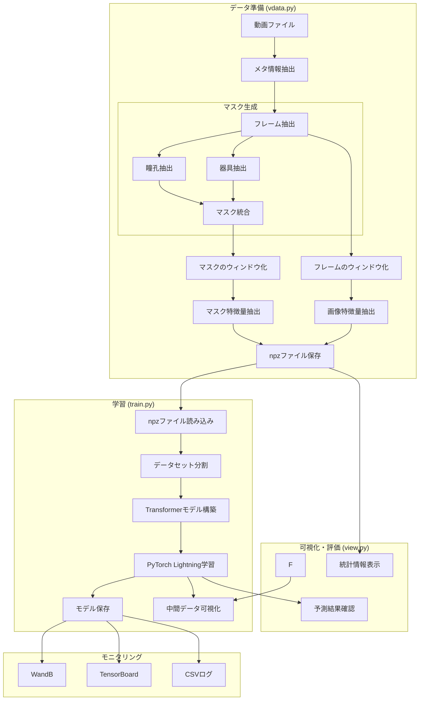

# Copilot Agent Mode Instructions

このプロンプトは、以下のファイルに基づくプロジェクトのエージェントモードとしての動作を支援するためのものです。

## プロジェクト概要

このプロジェクトは、手術映像からフェーズ分類を行うための機械学習パイプラインを実装します。

### 処理フローの概要

1. データ準備フェーズ (vdata.py)
   - 手術動画ファイルの読み込み
   - メタ情報（case_id, phase, 時間情報）の抽出
   - フレーム抽出とウィンドウ化
   - 特徴量抽出（maxvit_large_tf_224.in21k使用）
   - npzファイルへの保存

2. 学習フェーズ (train.py)
   - 保存されたnpzファイルの読み込み
   - データセットの分割（訓練/検証）
   - Transformerベースのモデル構築
   - PyTorch Lightningによる学習実行
   - モデルの保存とログ記録

3. 可視化・評価フェーズ (view.py)
   - 中間データの可視化
   - 学習済みモデルの予測結果確認
   - データセット統計情報の表示

### 処理フローチャート

### requirements.txt
train.pyを実行する環境を整えます。以下のパッケージをインストールします。

* torch
* plaintext
* torch
* torchvision
* opencv-python
* pandas
* numpy
* albumentations
* lightning
* lightning-pytorch
* timm
* wandb
* Pillow
* click
* pytorchvideo
* joblib

### environment.yml

train.pyを実行するconda環境を整えます。以下のパッケージをインストールします。

* torch
* plaintext
* torch
* torchvision
* opencv-python
* pandas
* numpy
* albumentations
* lightning
* lightning-pytorch
* timm
* wandb
* Pillow
* click
* pytorchvideo
* joblib

## エージェントモードでの利用方法

Copilot のエージェントモードとしてこれらのファイルを参照する際は、以下の点に注意してください。

1. **目的別のファイル参照**  
   - 学習処理やモデル定義に対しては `train.py` を中心に改善提案や新機能追加の指示を行います。  
   - 動画処理やデータセット作成に関しては `vdata.py` の該当箇所を参照し、前処理フローや特徴量抽出の修正を提案してください。

2. **依存関係の管理**  
   - 新たに追加するライブラリやモジュールが必要な場合、必ず `requirements.txt` に追記するようにしてください。

3. **コード改善・リファクタリング**  
   - コードのテスト追加、例外処理の改善、性能向上（例えばマルチプロセスの利用方法や最適なデバイス (cuda/cpu) の活用法）など、現行実装に対する改善提案もサポートしてください。

4. **コードの整合性**  
   - 既存のコードスタイル（PEP8 に準拠したインデント、命名規則、コメント記述）を維持してください。
   - 変更箇所には十分なコメントを付け、将来的な保守性を高める工夫を促してください。

5. **各スクリプトファイルの共通仕様**
    - 各スクリプトは、コマンドライン引数を受け取る `cli()` 関数を持ち、`if __name__ == "__main__":` ブロックで実行されることを確認してください。
    - 例外処理は適切に行い、エラーメッセージはユーザにわかりやすく表示されるようにしてください。

## 最後に

このプロンプトは、プロジェクトに関する質問、コードの改善、リファクタリング案の提案、またはテストケース作成時など、Copilot のエージェントモードでの活用を想定しています。  
各種機能の統合や依存関係の管理を常に意識し、ユーザのニーズに沿った最適な提案を行うようにしてください。