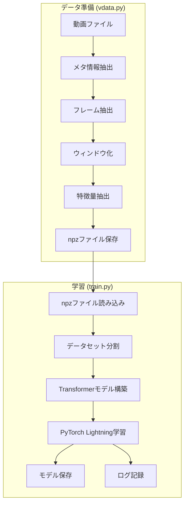

# OphNet手術フェーズ分類器

OphNet手術フェーズ分類器は、手術動画のフレームから手術フェーズを自動的に分類するための高度な機械学習システムです。このシステムは、手術映像からフレームを抽出し、maxvit_large_tf_224.in21kモデルを使用して深層特徴量を抽出、それらをTransformerベースのニューラルネットワークで処理することで、手術の各時点におけるフェーズを高精度に分類します。

## システムの特徴

1. 効率的なデータ処理：スライディングウィンドウアプローチにより、時系列データの文脈を考慮した特徴抽出を実現。並列処理による高速なデータ処理とメモリ効率の最適化を実現しています。

2. 柔軟なアーキテクチャ：PyTorchとPyTorch Lightningを基盤とし、マルチGPU環境での分散学習をサポート。CPU環境でも動作可能な適応性の高い設計となっています。

3. 包括的な実験管理：Weights & Biasesによる実験追跡、TensorBoardによる視覚化、CSVログによるローカルデータ保存など、多様なモニタリングツールを統合しています。

4. 実用的な可視化機能：データセットの統計分析、モデルの予測結果の可視化、中間特徴量の検証など、様々な分析ツールを提供します。

本システムは、医療現場での手術ワークフロー分析や手術支援システムの開発に活用できる、拡張性と保守性を重視した実装となっています。

## 処理フロー



## コンポーネント概要

### 1. データ処理 (`vdata.py`)
- 手術動画からの画像・マスク抽出
- 特徴量抽出（maxvit_large_tf_224.in21k）
- スライディングウィンドウによるフレーム処理
- 中間データの保存（.npz形式）

### 2. モデル学習 (`train.py`)
- Transformerベースの特徴量分類器
- PyTorch Lightningによる学習管理
- Weights & Biasesによる実験管理
- マルチGPUサポート

3. 可視化・分析 (`view.py`)
   - 画像・マスクの可視化
   - 特徴量統計情報の表示
   - データセット分析
   - モデル予測の可視化

### 技術スタック

- フレームワーク: PyTorch, PyTorch Lightning
- 特徴量抽出: timm (maxvit_large_tf_224.in21k)
- データ処理: OpenCV, NumPy, Pandas
- 可視化: Matplotlib
- 実験管理: Weights & Biases

## 環境構築

### Condaを使用する場合

```bash
# 環境の作成
conda env create -f environment.yml
conda activate img_mask_classifier

# 環境の更新（必要な場合）
conda env update -f environment.yml
```

### Pipを使用する場合

```bash
# 仮想環境の作成
python -m venv venv
source venv/bin/activate  # Linux/macOS
# または
.\venv\Scripts\activate   # Windows

# 依存パッケージのインストール
pip install -r requirements.txt
```

## 使用方法

### 1. 特徴量抽出

動画から特徴量を抽出し、.npzファイルとして保存します。

```bash
python vdata.py \
  --video_dir /path/to/videos \
  --intermediate_pth ./vdata_mediate \
  --extract_features \
  --n_jobs 4
```

主なオプション：
- `--video_dir`: 動画ファイルのディレクトリ
- `--intermediate_pth`: 中間ファイル（.npz）の保存先
- `--extract_features`: 特徴量抽出を有効化
- `--n_jobs`: 並列処理数
- `--no_save_images`: 画像データを保存しない（容量削減）
- `--device`: 使用するデバイス（'cuda'/'cpu'）

### 2. データの確認

抽出した特徴量や画像データを確認します。

```bash
# npzファイルの画像を可視化
python view.py show-image-from-npz ./vdata_mediate/case_001.npz

# npzファイルの特徴量情報を表示
python view.py show-features-from-npz ./vdata_mediate/case_001.npz
```

### 3. モデルの学習

抽出した特徴量を使用してモデルを学習します。

```bash
# Weights & Biases を使用する場合
python train.py \
  --npz_dir ./vdata_mediate \
  --output_dir ./models \
  --batch_size 32 \
  --max_epochs 100 \
  --feature_dim 1024 \
  --learning_rate 1e-4 \
  --gpus "0" \
  --use_wandb \
  --wandb_project "my-project" \
  --wandb_run_name "experiment-1"

# ローカルログのみを使用する場合
python train.py \
  --npz_dir ./vdata_mediate \
  --output_dir ./models \
  --batch_size 32 \
  --max_epochs 100 \
  --feature_dim 1024 \
  --learning_rate 1e-4 \
  --gpus "0"

# 複数GPU使用の場合（DDPモード）
python train.py \
  --npz_dir ./vdata_mediate \
  --output_dir ./models \
  --batch_size 32 \
  --max_epochs 100 \
  --feature_dim 1024 \
  --learning_rate 1e-4 \
  --gpus "0,1"

# CPU使用の場合
python train.py \
  --npz_dir ./vdata_mediate \
  --output_dir ./models \
  --batch_size 32 \
  --max_epochs 100 \
  --feature_dim 1024 \
  --learning_rate 1e-4 \
  --device "cpu"
```

主なオプション：
- `--npz_dir`: 特徴量の入ったnpzファイルのディレクトリ
- `--output_dir`: モデルの保存先ディレクトリ
- `--batch_size`: バッチサイズ
- `--max_epochs`: 最大エポック数
- `--feature_dim`: 特徴量の次元数
- `--learning_rate`: 学習率

### 4. 予測の可視化

学習したモデルの予測結果を可視化します。

```bash
python view.py show-prediction \
  --model_ckpt ./models/checkpoint.ckpt \
  --npz_path ./vdata_mediate/case_001.npz
```

## データ形式

### 入力動画の命名規則
```
<case_id>-<phase>-<start_time>-<end_time>.mp4
```

例：`case_0100-12-251.17-265.8.mp4`

### 中間ファイル（.npz）の構造
- `images`: フレーム画像 (nframe, height, width, 3)
- `masks`: マスク画像 (nframe, height, width, 3)
- `features`: 画像特徴量
- `mask_features`: マスク特徴量
- `label`: one-hotエンコードされたラベル

## 注意事項

1. GPU環境の推奨
   - 特徴量抽出と学習には、CUDAが使用可能なGPUを推奨
   - 最小16GB以上のGPUメモリを推奨

2. ストレージ要件
   - 画像データを含む中間ファイルは大容量になる可能性あり
   - 必要に応じて`--no_save_images`オプションを使用

3. メモリ管理
   - 大量のデータを扱う場合は`batch_size`と`num_workers`を調整
   - 必要に応じて`max_frames`オプションでフレーム数を制限